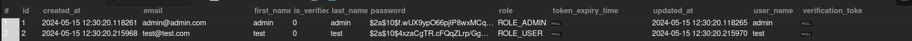
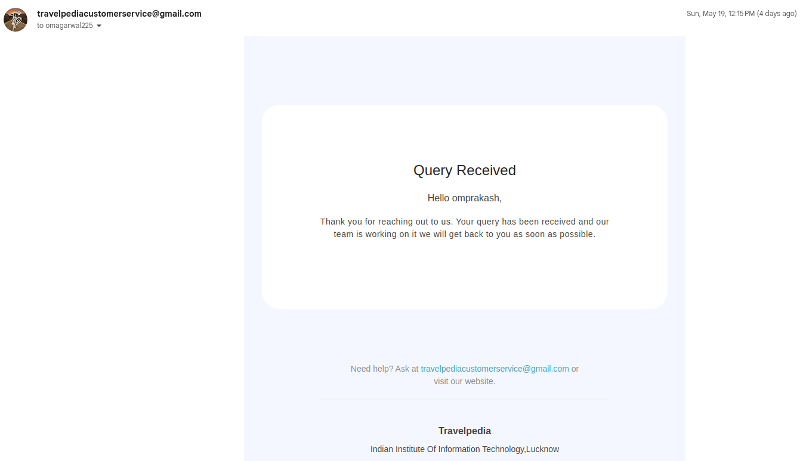
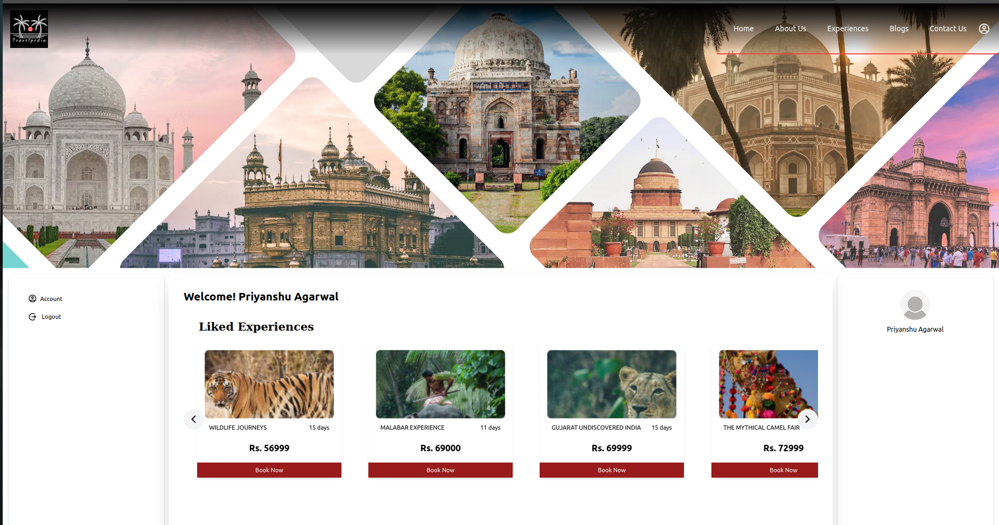
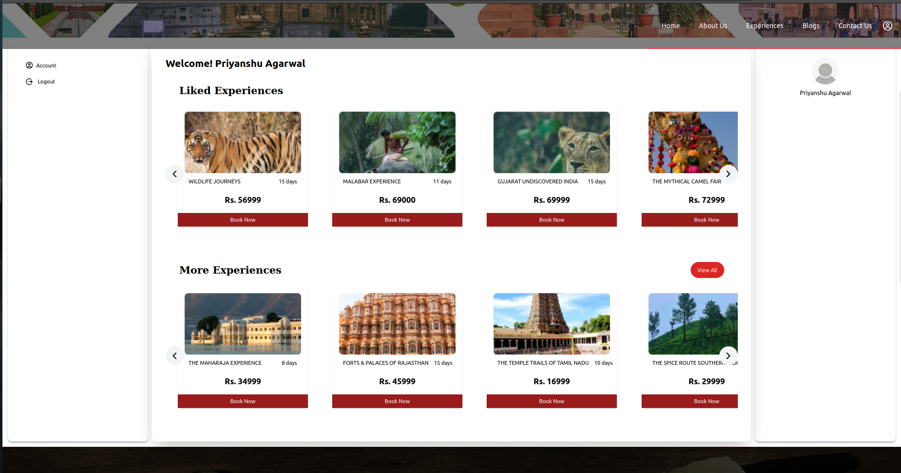
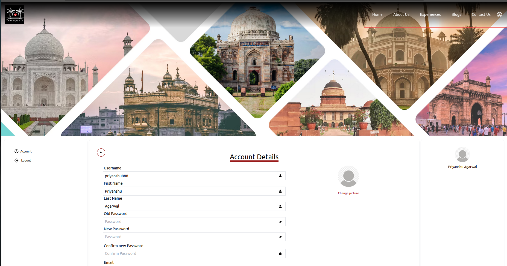
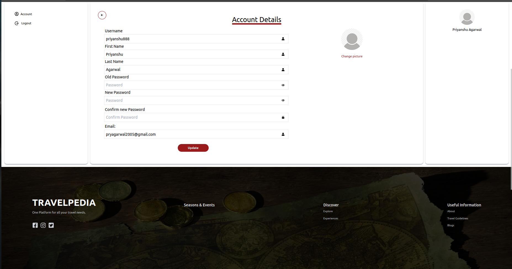

# TravelPedia

Your Gateway to Seamless Tourism

# Description

Our Travel Website is the ultimate guide for exploring major tourist destinations. if you are a first time adventurer we’ve got you covered.

Our Goal Is to Make the Most Out of Your Trip and Create Unforgettable Memories.

# Goals and Objectives

- <b><i>Accessiblity</i></b> :
  TRAVELPEDIA ensures that our travel guides are user-friendly, informative, and readily available to anyone seeking adventure.

* <b><i>Authenticity</i></b> :
  Our guides are crafted with care to provide you with an authentic travel experience that goes beyond the surface.

* <b><i>Community </i></b>:
  We encourage you to share your experiences, tips, and recommendations with our global community, fostering a culture of collaboration and camaraderie.

# Tech Stack Used

<ul>
<li><b><i>Frontend -:    </i></b>  React, Tailwind CSS
 
<li><b><i>Backend -:     </i></b> Spring Boot 
 
<li><b><i>Database -:    </i></b> MySQL
 
<li><b><i>Deployment -:   </i></b> Amazon AWS WebServices

</ul>

# The Project Overview

## Home page

Home page being the first page the users usually visit, presents before the user everythign that Travelpedia offer.

## Experiences

Experience page showcases the list of all the available experiences provided by Travelpedia. Alongisde it's intuituve UI, it provides users a range of features:-

- 1. Users can sort the experiences in a click as per one of the following options:-

https://github.com/aryamagarwal/TravelPedia/assets/143252449/1ac9b2c0-c126-46c1-820f-d31e95514bd2

- 2. Users can apply filter experiences as per their requirements to find those that suit their needs and fit in their budgets

https://github.com/aryamagarwal/TravelPedia/assets/143252449/27ae4ce0-9dc9-4ca7-863c-6297ab71efa7

- 3. Pagination is also added which helps to load only the required data in smaller parts and improves the overall User Epxerience.

https://github.com/aryamagarwal/TravelPedia/assets/143252449/97b95bf6-3aea-47c5-8656-08cd064ec20a

- 4. Users can like experience once logged in.

- 5. Allows admin to add , update and delete experiences
     
     

- 6. Browse experiences in detail.
     
     

## Blogs

 

The blog section of the site is a dynamic and informative space designed to engage, inspire, and assist travelers in every stage of their journey. This section is typically a rich tapestry of content, featuring a diverse array of articles, guides, and stories that cater to the varied interests and needs of the travel community.

Upon entering the blog section, users are greeted with a visually appealing layout that often includes a mix of featured articles and the latest posts. High-resolution images accompany each blog post, providing a visual teaser of the content and enticing readers to delve deeper into the articles.

Travel tips articles from the experienced travellers cover a broad spectrum of topics, such as packing advice, budget travel, safety tips, and how to navigate cultural differences. These posts are invaluable for both novice and seasoned travelers, offering insights that can enhance their travel experiences and help them avoid common pitfalls.

Overall, the blog section Travelpedia serves as a valuable resource and an engaging platform for travelers. It combines informative content with inspiring narratives, creating a space where users can both dream about their next adventure and find the practical information they need to make it a reality.

 <!--   -->

 

The "Add Blog" feature on the blog section of our site is designed to empower users to share their unique travel experiences and insights with the community. When users select the "Add Blog" option, they are prompted with a user-friendly pop-up form where they can easily contribute their own content. This form includes fields for the title of the blog, the main content of the blog, the date of publication, the author’s name, and an image URL to visually represent their story. This streamlined process ensures that contributing to the travel blog is both accessible and straightforward, encouraging more user-generated content and fostering a richer, more diverse travel community.

Advantages of the Add Blog Feature:

- <b><i>Community Engagement:</i></b>
  Encourages active participation from users, creating a more vibrant and interactive community.

- <b><i>Diverse Perspectives:</i></b> Allows a variety of voices and experiences to be shared, providing readers with a wide range of travel insights and stories.
- <b><i>Fresh Content:</i></b> Ensures a steady stream of new content, keeping the blog section dynamic and up-to-date.
- <b><i>User Empowerment:</i></b> Empowers users to contribute their own stories, enhancing their connection to the site and its community.

* <b><i>Enhanced Resource:</i></b> Builds a comprehensive resource of travel information and personal narratives, benefiting all users.

- <b><i>Authenticity:</i></b> User-generated content adds authenticity and relatability, making the blog more engaging and trustworthy.
- <b><i>SEO Benefits:</i></b> Regularly updated content from various contributors can improve the site's search engine ranking, attracting more visitors.
<!-- - <b><i>Community Building:</i></b> Helps to foster a sense of belonging and community among users who share a passion for travel. -->

As soon as the user add the blog in our site a post request is sent to the backend which adds the blog to our database and can easily be fetched.

## SignUp

<!--  -->

The signUp form allows users to register on our site. The user can rejister only when he has entered a unique username and email.

The Sign Up form has folllowing features -:

- <b><i>Username and email check</i></b> : The user would be able to know if the username/email he has entered is availaible or not

- <b><i>Password Regex:</i></b> The SignUp form also has a password regex which would allow only strong password the criteria for strong password will be shown to user as soon as he starts typing

<!--  -->
- <b><i>Password toggle </i></b>:
  Also the signUp form allows user to toggle the password field to text field enabling him to view the password that he is typing.

- <b><i>Password Confirmation</i></b>
  The user has to also confirm the password that he has entered. This helps in preventing typographical errors, verifying intent, enhancing security and enchancing the user experience.

## Verify Form

After the user registers himself he would be propmted with the verfy form where he after entering the username and clicking the send otp button would be recieving an email from our email handle
in which he would be able to get the OTP that was sent through spring java mail sender (MimeMessenger)
If he enters the correct OTP he would be navigated to his dashboard and also a Json Web token (JWT) would be assigned to him in his local storage.

The verify form has following features

- <b><i>Resend OTP</i></b> :If the user didn't recieve OTP he can press on resend otp button and email would be send to him directly to his email address that he has provided

- <b><i>OTP validation</i></b>: It is neccesary for the user to enter the correct OTP else he would not be navigated to the user dashboard.

- <b><i>Timer</i></b>: It is neccesary for the user to enter the correct OTP under 5 minutes of time else the OTP would expire.

## Email One Time Password(OTP)

The user would recieve the email from the Travelpedia customer service (name of the email account that we created to send otp and queries) with a subject Verify your Travelpedia Account. The email would be sent only to the email address provided by the user.

Also the OTP would be generated at random by using the math library provided by JAVA.This would help in creating a authentic OTP which would be sent directly to the email account of the user.

## Json Web Token (Jwt)

The Json web token would be generated from the backend and returned if the user has sucessfully registered/login and would be stored in the local storage using react. Local Storage allow to save key/value pairs in a web browser. It is a place to save the login user’s info.

## JWT Authentication Sequence

<ol>
<li><b><i>User Registration Phase: – </b></i>User uses a register form(made using react js) to post user’s info ( username, email,firstname lastname and password) to Backend API `/api/auth/signup` . Backend will check the existing users in database and save user’s signup info to database. Finally, It will return a message (successfully or fail) to regiter.

<li><b><i>User Login Phase: – </b></i>User posts user/password to signin to Backend RestAPI `/api/auth/signin`. .Backend will check the username/password, if it is right, Backend will create and JWT string with secret then return it to Reactjs client.
</ol>
After signin, user can request secured resources from backend server by adding the JWT token in Authorization Header. For each request, backend will check the JWT signature and then returns back the resources based on user’s registered authorities.
`bearer token `

## Login

The user can enter any of his username or email with the passord fild and press on login button . If the credentials are found to valid the backend(spring) would return a jwt which would be stored in user's local storage using which the user can request secured resources from backend server by adding the JWT token in Authorization Header. For each request, backend will check the JWT signature and then returns back the resources based on user’s registered authorities.

The LogIn form has following features

- <b><i>Username/Email: </i></b>
  The user would be able to login by using his username or email this would help him if he has forgotten his email address or his username.

- <b><i> Forgot Password: </i></b>
  The login form has a forgot password option that would help him in case he has forgot the password so he can reset it through the forgot password page .

- <b><i> Correct Detail validation: </b></i>
  The user has to enter correct details only. Since after the user entered his/her details a request is sent to the backend to check if the credentials provided by the user are valid or not. If they are not valid he would not be provided with the JWT token and would not be navigated to the site.

* <b><i>Verified user validation :</i></b>
  If the user has not provided the OTP at the time of SignUp he would be redirected to the verify form and would not be navigated to the dashboard untill he gets verified through the OTP.

  ## Forgot Password

  
  

The Forgot password page helps the user to change his account password in case he forgets it.

When the user tries to change the passord through forgot password feature the user would have to give his username and new password which would be posted to the backend (Spring) which will access the user details according to the email(which is unique) and changes the password accordingly. When the user enters his/her credentials he would be navigated to a verify form where he would have to enter the otp recieved on his mail account.

Features of Forgot Password form-:

- <b><i>Password Regex</i></b> : This allows user to give strong password only and prevents him/her from entering an easy password. This ensures security of his details.

- <b><i>OTP Verification</i></b> : This prevents unauthorized users from changing the user's password without his/her permission the otp ensures that user account is safe and also informs him if in case anybody has tried to change his/her account password.

## User Entity

The above image shows the user entity stored in MySQL Database the entity has following columns-:

<ul>
<li><b><i>id</i></b> : Stores the id of the user
<li><b><i>created_at : </i></b> Stores the time and  date at which the user was added to the database
<li><b><i>email : </i></b>Stores the email address of the user provided by the user.This field is unique ensuring user cannot have multiple accounts
<li><b><i> first_name : </i></b>Stores the first name of the user that has registered on the platform.
<li><b><i>is_verified : </i></b>Stores a boolean value which specifies if the user has verified through One Time Password (OTP) or not.
<li><b><i>last_name : </i></b>Stores the last name of the user registered on out platform.
<li><b><i>Password : </i></b>Stores the password of the user in hashed form using the BCryptPassword encoder which is provided by default by the Spring boot . 
<li><b><i>role : </i></b> Specifies the role of the user-: admin or user. 
<li><b><i>token_expiry_time : </i></b>Specifies the time of the expiry of the Json web token generated through spring boot.
<li><b><i>updated_at :</i></b> Stores the time and date at which the user field was updated .
<li><b><i>verification_token : </i></b>Stores the Json Web Token(JWT) which is generated through spring boot.

</ul>

<b>Important note:</b> The rows showede in the image are just for testing purposes and no verification token was generated for it so they have been set as null. But for the rest of the real users the columns are filled respectively.

# Contact Us

The Contact us feature allows users to submit their queries. The user details(like username and email) are prefilled and cannot be changed.This allows users to easily file their queries. After they submit the query a post request is sent to the backend containing (username,email and query details). Also a mail is sent to the user which helps him know that his query was sucessfully submitted at our portal and we are working on it.

Features of Contact us page

- <b><i>Show Tickets</i></b> : This option allow the user to see the status of his queries that he has submitted on our portal. This can be a really helpful tool for the user if he has submitted multiple queries and has to know the status of each of his query .

- <b><i>Mail service</i></b> : This allows user to send the mail to the user when he submits the query. This ensures reliablity and ensures the users that we are working on their query.

- <b><i>Prefilled Credentials</i></b>: This allows the logged in users to only focus without worrying about filling the credentials. Also the user credentials input field is disabled to ensure security and reliablity.

## Email recieved by the user

The email is recieved by the user once he submited the query. This ensures the user that we are working on thier query.

The email is sent throught the travelpediacustomerservice account (the google account that we created) for the purpose of this project. The email is sent using the backend spring boot using java mail sender and mime messsenger provided by the spring after installing the mail dependencies.

# User Dashboard

The user dashboard allows user to see his liked experiences and the top experiences respectively. Also the user can easily navigate to account section where he can modify his details also he gets an option to logout.

Features of user dashboard

- <b><i>Liked Experiences</i></b>: The user can see his liked experiences in the dashboard thus making the site dynamic and user friendly. Ths feature can be beneficial for tose users who want to save the experiences for future.

- <b><i>Easy Navigation</i></b>: The user gets the options of accounts where he can update his details and also the user gets an option of logout from which user can easily logout from the site.

- <b><i>Toastify</i></b> : The dashboard also has toastify component that makes it more engaging and user friendly. For example hen the user will log in the dashboard would open with a toast "logged in successfully" and if he log outs it would display "logged out successfully". Such toast components have been added to other pages of the site as well.

# Account

<!--  -->

The account section allows the user to modify his details provided by him while registering. When user clicks the update details button a request is sent to the backend and the field values are changed respectively and the user is set to not verified.

The user is naviated to the verify form upon updating his account details. Upn filling up the verify form the email is sent to user with an One Time Password(OTP)for security purposes upon entering the correct details the user is logged in and a token is provided to him and his corresponding verified field in the user database is set to true.

# Steps for cloning the project:-

- Open Git Bash.
- Change the current working directory to the location where you want the cloned directory.
- Type `git clone https://github.com/aryamagarwal/TravelPedia`

# Steps for running the project for the first time:-

- Run the following command to install all the dependencies
  `npm install`
- Run the following command to run the project on your local host
  ` npm run dev`
- Open a new terminal, and run the following command to run json on your localhost
  `npx json-server --watch src/assets/db/db.json --port 8000`

\*Whenever you pull, make sure you run `npm install` to install the dependencies added to the project.
hello
