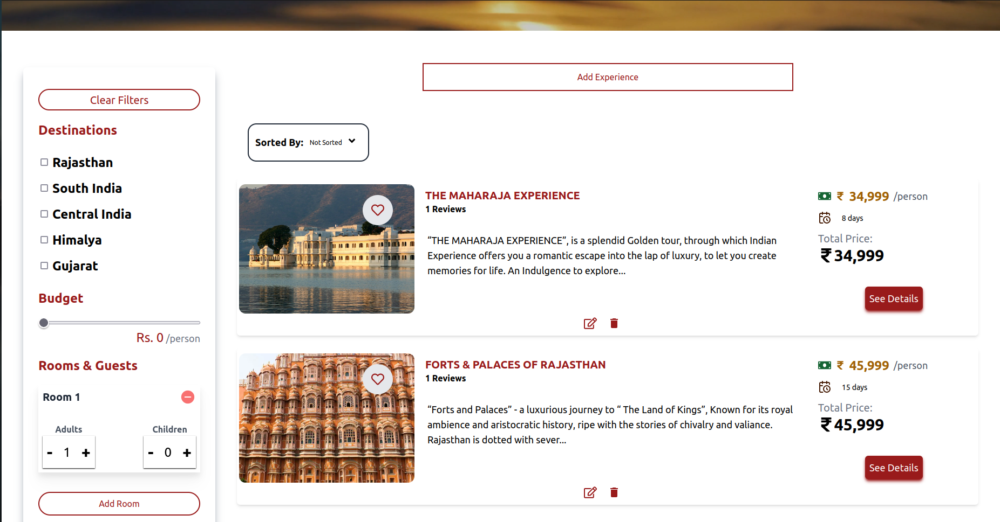
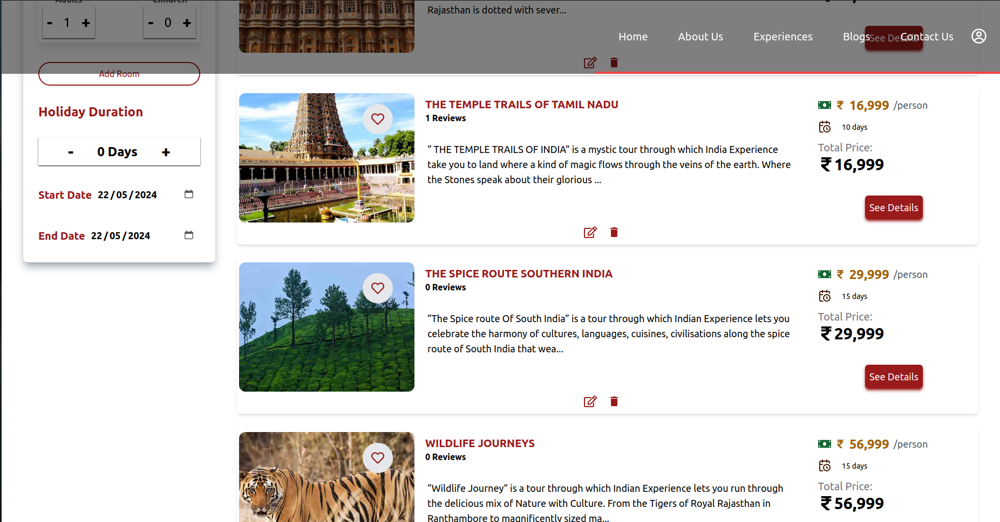
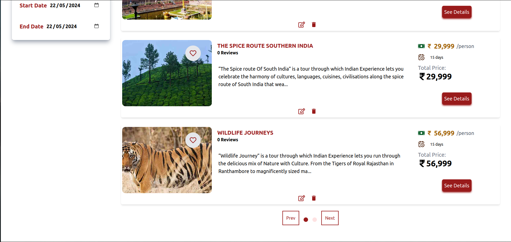
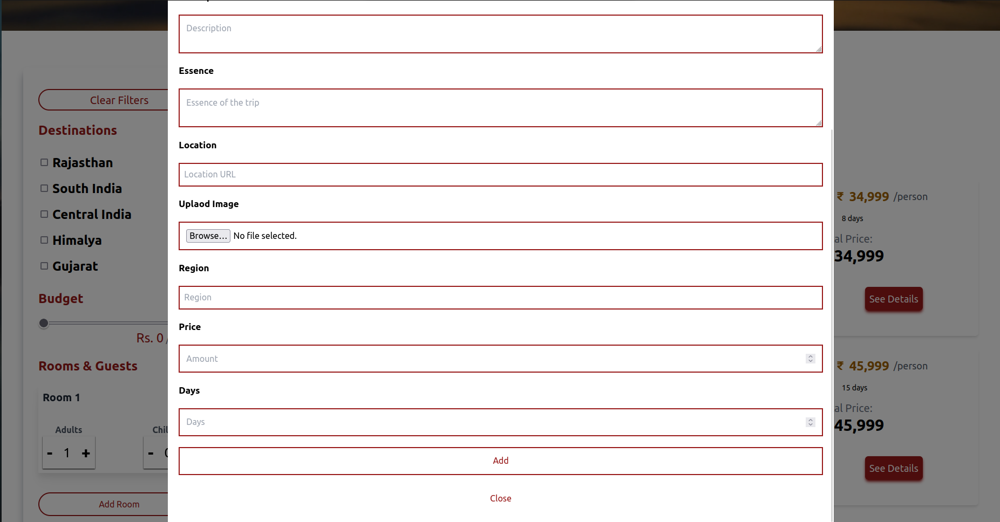
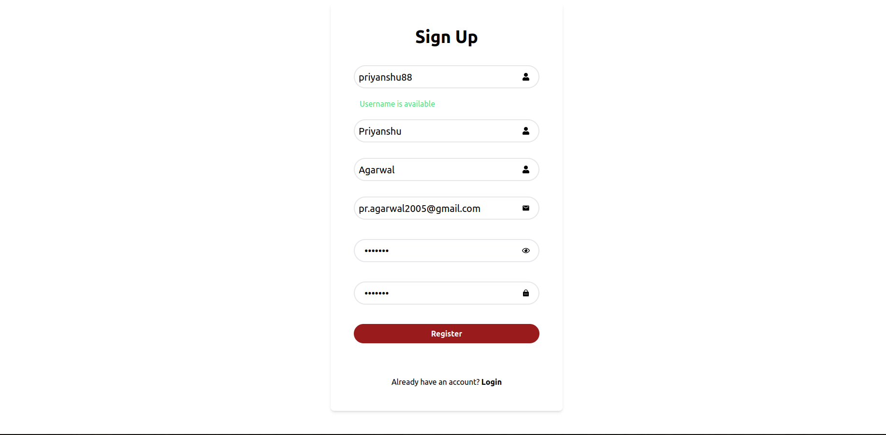
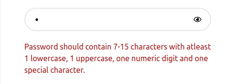
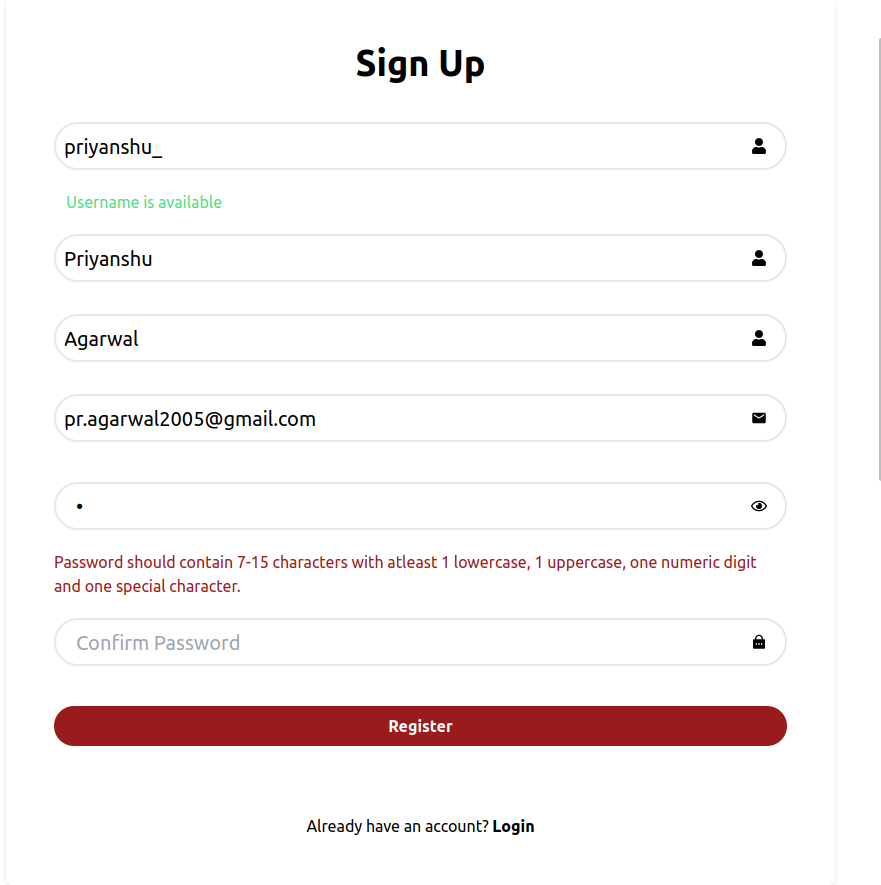
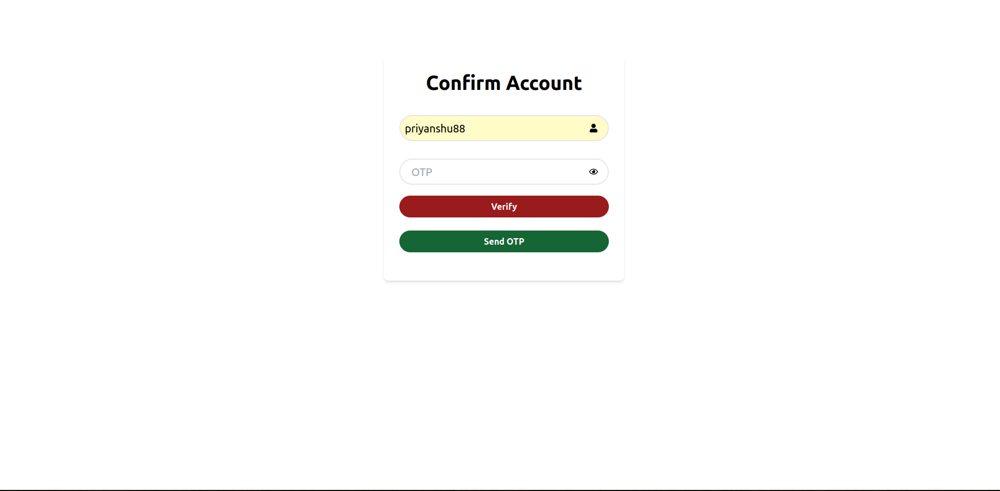
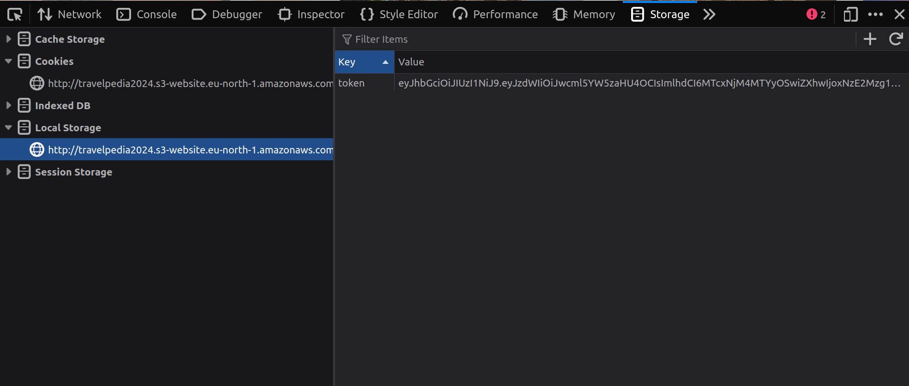
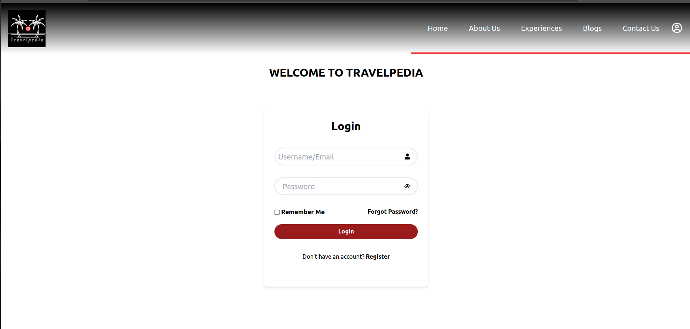

# TravelPedia

Your Gateway to Seamless Tourism

# Description

Our Travel Website is the ultimate guide for exploring major tourist destinations. if you are a first time adventurer we’ve got you covered.

Our Goal Is to Make the Most Out of Your Trip and Create Unforgettable Memories.

# Goals and Objectives

- <b><i>Accessiblity</i></b> :
  TRAVELPEDIA ensures that our travel guides are user-friendly, informative, and readily available to anyone seeking adventure.

* <b><i>Authenticity</i></b> :
  Our guides are crafted with care to provide you with an authentic travel experience that goes beyond the surface.

* <b><i>Community </i></b>:
  We encourage you to share your experiences, tips, and recommendations with our global community, fostering a culture of collaboration and camaraderie.

# Tech Stack Used

<ul>
<li><b><i>Frontend-:</i></b>  React, Tailwind CSS
 
<li><b><i>Backend-: </i></b> Spring Boot 
 
<li><b><i>Database-:</i></b> MySQL
 
<li><b><i>Deployment-: </i></b> Amazon AWS WebServices

</ul>

# The Project

## Home page

Home page being the first page the users usually visit, presents before the user everythign that Travelpedia offer.

## Experiences

Experience page showcases the list of all the available experiences provided by Travelpedia. Alongisde it's intuituve UI, it provides users a range of features:-

1) Users can sort the experiences in a click as per one of the following options:-

2) Users can apply filter experiences as per their requirements to find those that suit their needs and fit in their budgets

3) Pagination is also added which helps to load only the required data in smaller parts and improves the overall User Epxerience.

## Blogs

 

 <!--   -->

 

## SignUp

<!--  -->

The signUp form allows users to register on our site. The user can rejister only when he has entered a unique username and email.

The Sign Up form has folllowing features -:

- <b><i>Username and email check</i></b> : The user would be able to know if the username/email he has entered is availaible or not

- <b><i>Password Regex:</i></b> The SignUp form also has a password regex which would allow only strong password the criteria for strong password will be shown to user as soon as he starts typing

<!--  -->
- <b><i>Password toggle </i></b>:
  Also the signUp form allows user to toggle the password field to text field enabling him to view the password that he is typing.

- <b><i>Password Confirmation</i></b>
  The user has to also confirm the password that he has entered. This helps in preventing typographical errors, verifying intent, enhancing security and enchancing the user experience.

## Verify Form

After the user registers himself he would be propmted with the verfy form where he after entering the username and clicking the send otp button would be recieving an email from our email handle
in which he would be able to get the OTP that was sent through spring java mail sender (MimeMessenger)
If he enters the correct OTP he would be navigated to his dashboard and also a Json Web token (JWT) would be assigned to him in his local storage.

The verify form has following features

- <b><i>Resend OTP</i></b> :If the user didn't recieve OTP he can press on resend otp button and email would be send to him directly to his email address that he has provided

- <b><i>OTP validation</i></b>: It is neccesary for the user to enter the correct OTP else he would not be navigated to the user dashboard.

- <b><i>Timer</i></b>: It is neccesary for the user to enter the correct OTP under 5 minutes of time else the OTP would expire.

## Email One Time Password(OTP)

The user would recieve the email from the Travelpedia customer service (name of the email account that we created to send otp and queries) with a subject Verify your Travelpedia Account. The email would be sent only to the email address provided by the user.

Also the OTP would be generated at random by using the math library provided by JAVA.This would help in creating a authentic OTP which would be sent directly to the email account of the user.

## Json Web Token (Jwt)

The Json web token would be generated from the backend and returned if the user has sucessfully registered/login and would be stored in the local storage using react. Local Storage allow to save key/value pairs in a web browser. It is a place to save the login user’s info.

## JWT Authentication Sequence

<ol>
<li><b><i>User Registration Phase: – </b></i>User uses a register form(made using react js) to post user’s info ( username, email,firstname lastname and password) to Backend API `/api/auth/signup` . Backend will check the existing users in database and save user’s signup info to database. Finally, It will return a message (successfully or fail) to regiter.

<li><b><i>User Login Phase: – </b></i>User posts user/password to signin to Backend RestAPI `/api/auth/signin`. .Backend will check the username/password, if it is right, Backend will create and JWT string with secret then return it to Reactjs client.
</ol>
After signin, user can request secured resources from backend server by adding the JWT token in Authorization Header. For each request, backend will check the JWT signature and then returns back the resources based on user’s registered authorities.
`bearer token `

## Login

The user can enter any of his username or email with the passord fild and press on login button . If the credentials are found to valid the backend(spring) would return a jwt which would be stored in user's local storage using which the user can request secured resources from backend server by adding the JWT token in Authorization Header. For each request, backend will check the JWT signature and then returns back the resources based on user’s registered authorities.

The LogIn form has following features

- <b><i>Username/Email: </i></b>
  The user would be able to login by using his username or email this would help him if he has forgotten his email address or his username.

- <b><i> Forgot Password: </i></b>
  The login form has a forgot password option that would help him in case he has forgot the password so he can reset it through the forgot password page .

- <b><i> Correct Detail validation: </b></i>
  The user has to enter correct details only. Since after the user entered his/her details a request is sent to the backend to check if the credentials provided by the user are valid or not. If they are not valid he would not be provided with the JWT token and would not be navigated to the site.

* <b><i>Verified user validation :</i></b>
  If the user has not provided the OTP at the time of SignUp he would be redirected to the verify form and would not be navigated to the dashboard untill he gets verified through the OTP.

  ## Forgot Password
  

  # Contact Us

  # User Dashboard

  # Account

# Steps for cloning the project:-

- Open Git Bash.
- Change the current working directory to the location where you want the cloned directory.
- Type `git clone https://github.com/aryamagarwal/TravelPedia`

# Steps for running the project for the first time:-

- Run the following command to install all the dependencies
  `npm install`
- Run the following command to run the project on your local host
  ` npm run dev`
- Open a new terminal, and run the following command to run json on your localhost
  `npx json-server --watch src/assets/db/db.json --port 8000`

\*Whenever you pull, make sure you run `npm install` to install the dependencies added to the project.
hello
